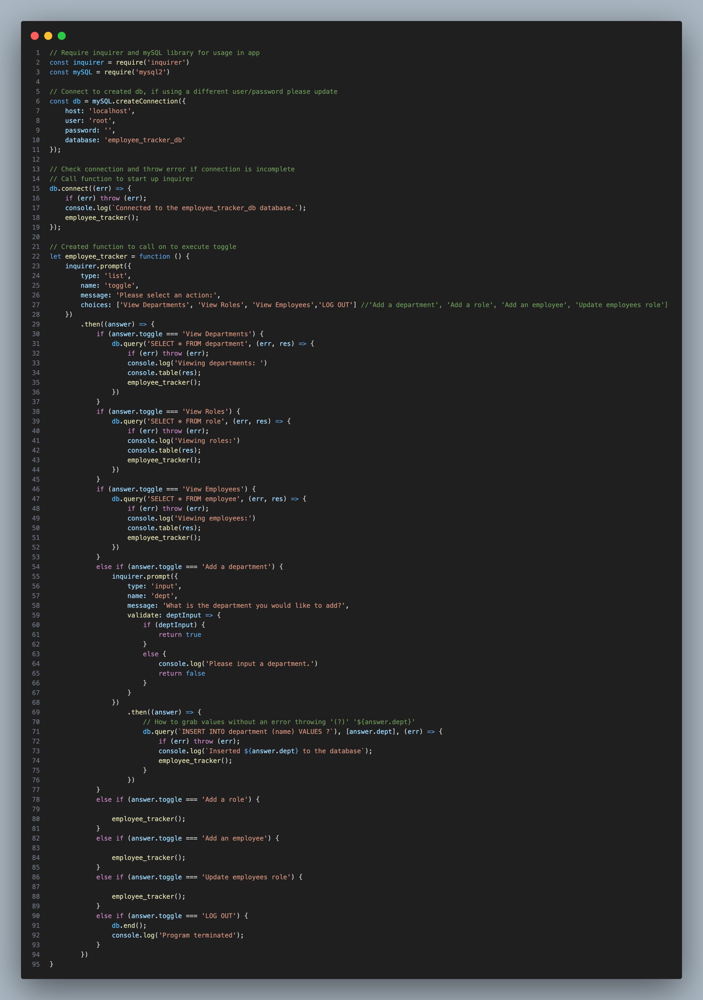

# SQL Employee Tracker

## Description

Simple CLI application that grabs data from an SQL database and displays that information in the command line. Data can be added and manipulated using different selections in the CLI

## Table of Contents

- [Installation](#installation)
- [Usage](#usage)
- [License](#license)
- [Contibution](#contribution)
- [Tests](#tests)
- [Questions](#questions)

## Installation

To install the project, clone the repo, navigate to it in your coding application, run the schema + seeds in mySQL to generate a database + insert values. Update index.js to match your SQL user and pass. Run "npm i" to install dependencies, then run "node index.js" to start the application.

## Usage

Scroll through the options after running index.js, when you select them it will display data or prompt you with the changes you can make.

## License

## Contribution

## Tests

Link to video displaying functionality:
https://drive.google.com/file/d/1evGMkkzvC3ThqKifP9Bk8ZMrHf-vBQTf/view

## Questions

https://www.github.com/dylanstoudt
-----------------
dylanstoudt@aol.com
-----------------
Please contact me via: Email
